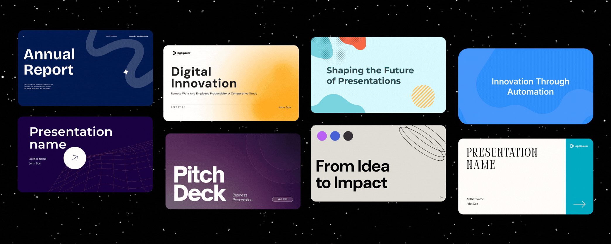

<p align="center">
  
</p>

<p align="center">
  <a href="https://presenton.ai/download"><strong>Quickstart</strong></a> &middot;
  <a href="https://docs.presenton.ai/"><strong>Docs</strong></a> &middot;
  <a href="https://www.youtube.com/@presentonai"><strong>Youtube</strong></a> &middot;
  <a href="https://discord.gg/9ZsKKxudNE"><strong>Discord</strong></a>
</p>

<p align="center">
  <a href="https://github.com/presenton/presenton/blob/main/LICENSE"></a>
  <a href="https://github.com/presenton/presenton"></a>
  <a href="https://presenton.ai/"></a>
</p>

# Open-Source AI Presentation Generator and API (Gamma, Beautiful AI, Decktopus Alternative)

### ✨ Why Presenton

No SaaS lock-in · No forced subscriptions · Full control over models and data

What makes Presenton different?

- Fully **self-hosted**; Web (Docker) & Desktop (Mac, Windows & Linux)
- Works with OpenAI, Gemini, Anthropic, Ollama, or custom models
- API deployable
- Fully open-source (Apache 2.0)
- Use your **existing PPTX files as templates** for AI presentation generation

> [!TIP]
> **Star us!** A ⭐ shows your support and encourages us to keep building! 😇

<p align="center">
  
</p>

#

### 🎛 Features

<p align="center">
  
</p>

#

### 💻 Presenton Desktop

Create AI-powered presentations using your own model provider (BYOK) or run everything locally on your own machine for full control and data privacy.

<p align="center">
  <a href="https://presenton.ai/download">
    
  </a>
</p>

**Available Platforms**

<table>
<tr>
<th align="left">Platform</th>
<th align="left">Architecture</th>
<th align="left">Package</th>
<th align="left">Download</th>
</tr>

<tr>
<td><b>macOS</b></td>
<td>Apple Silicon / Intel</td>
<td><code>.dmg</code></td>
<td><a href="https://presenton.ai/download">Download ↗</a></td>
</tr>

<tr>
<td><b>Windows</b></td>
<td>x64</td>
<td><code>.exe</code></td>
<td><a href="https://presenton.ai/download">Download ↗</a></td>
</tr>

<tr>
<td><b>Linux</b></td>
<td>x64</td>
<td> <code>.deb</code></td>
<td><a href="https://presenton.ai/download">Download ↗</a></td>
</tr>

</table>

Presenton gives you complete control over your AI presentation workflow. Choose your models, customize your experience, and keep your data private.

- Custom Templates & Themes — Create unlimited presentation designs with HTML and Tailwind CSS
- AI Template Generation — Create presentation templates from existing Powerpoint documents.
- Flexible Generation — Build presentations from prompts or uploaded documents
- Export Ready — Save as PowerPoint (PPTX) and PDF with professional formatting
- Built-In MCP Server — Generate presentations over Model Context Protocol
- Bring Your Own Key — Use your own API keys for OpenAI, Google Gemini, Anthropic Claude, or any compatible provider. Only pay for what you use, no hidden fees or subscriptions.
- Ollama Integration — Run open-source models locally with full privacy
- OpenAI API Compatible — Connect to any OpenAI-compatible endpoint with your own models
- Multi-Provider Support — Mix and match text and image generation providers
- Versatile Image Generation — Choose from DALL-E 3, Gemini Flash, Pexels, or Pixabay
- Rich Media Support — Icons, charts, and custom graphics for professional presentations
- Runs Locally — All processing happens on your device, no cloud dependencies
- API Deployment — Host as your own API service for your team
- Fully Open-Source — Apache 2.0 licensed, inspect, modify, and contribute
- Docker Ready — One-command deployment with GPU support for local models
- Electron Desktop App — Run Presenton as a native desktop application on Windows, macOS, and Linux (no browser required)
- Sign in with ChatGPT — Use your free or paid ChatGPT account to sign in and start creating presentations instantly — no separate API key required

#

### ☁️ Presenton Cloud

Run Presenton directly in your browser — no installation, no setup required. Start creating presentations instantly from anywhere.

<p align="center">
  <a href="https://presenton.ai">
    
  </a>
</p>

#

### ⚡ Running Presenton

  <p>
    You can run Presenton in two ways:
    <strong>Docker</strong> for a one-command setup without installing a local dev
    stack, or the <strong>Electron desktop app</strong> for a native app
    experience (ideal for development or offline use).
  </p>

**Option 1: Electron (Desktop App)**

   <p>
    Run Presenton as a native desktop application. LLM and image provider
    (API keys, etc.) can be configured in the app. The same environment variables
    used for Docker apply when running the bundled backend.
  </p>

  <p>
    <strong>Prerequisites:</strong> Node.js (LTS), npm, Python 3.11, and
    <a href="https://docs.astral.sh/uv/">uv</a>
    (for the Electron FastAPI backend in
    <code>electron/servers/fastapi</code>).
  </p>

- Setup (First Time)
  <pre><code class="language-bash">cd electron
  npm run setup:env</code></pre>

  This installs Node dependencies, runs <code>uv sync</code> in the FastAPI
  server, and installs Next.js dependencies.

- Run in Development
  <pre><code class="language-bash">npm run dev</code></pre>
  <p>
  This compiles TypeScript and starts Electron. The backend and UI run locally
  inside the desktop window.
  </p>

- Build Distributable (Optional)
  To create installers for Windows, macOS, or Linux:
  <pre><code class="language-bash">npm run build:all
  npm run dist</code></pre>
  <p>
  Output files are written to <code>electron/dist</code>
  (or as configured in your <code>electron-builder</code> settings).
  </p>

**Option 2: Docker**

##### Build for Linux (arm64):
```bash
docker-compose -f docker-compose-arm.yml up --build`
`

without GPU:
```bash
docker-compose -f docker-compose-arm-cpu.yml up --build`
```

- Start Presenton
  Linux/MacOS (Bash/Zsh Shell):
  <pre><code class="language-bash">docker run -it --name presenton -p 5000:80 -v "./app_data:/app_data" ghcr.io/presenton/presenton:latest</code></pre>

  Windows (PowerShell):
  <pre><code class="language-bash">docker run -it --name presenton -p 5000:80 -v "${PWD}\app_data:/app_data" ghcr.io/presenton/presenton:latest</code></pre>

- Open Presenton
  <p>
  Open <a href="http://localhost:5000">http://localhost:5000</a> in the browser
  of your choice to use Presenton.
  </p>

  <blockquote>
  <p>
    <strong>Note:</strong> You can replace <code>5000</code> with any other port
    number of your choice to run Presenton on a different port number.
  </p>
  </blockquote>

#

### ⚙️ Deployment Configurations

These settings apply to both Docker and the Electron app's backend. You may want to directly provide your API KEYS as environment variables and keep them hidden. You can set these environment variables to achieve it.

- CAN_CHANGE_KEYS=[true/false]: Set this to **false** if you want to keep API Keys hidden and make them unmodifiable.
- LLM=[openai/google/anthropic/ollama/custom]: Select **LLM** of your choice.
- OPENAI_API_KEY=[Your OpenAI API Key]: Provide this if **LLM** is set to **openai**
- OPENAI_MODEL=[OpenAI Model ID]: Provide this if **LLM** is set to **openai** (default: "gpt-4.1")
- GOOGLE_API_KEY=[Your Google API Key]: Provide this if **LLM** is set to **google**
- GOOGLE_MODEL=[Google Model ID]: Provide this if **LLM** is set to **google** (default: "models/gemini-2.0-flash")
- ANTHROPIC_API_KEY=[Your Anthropic API Key]: Provide this if **LLM** is set to **anthropic**
- ANTHROPIC_MODEL=[Anthropic Model ID]: Provide this if **LLM** is set to **anthropic** (default: "claude-3-5-sonnet-20241022")
- OLLAMA_URL=[Custom Ollama URL]: Provide this if you want to custom Ollama URL and **LLM** is set to **ollama**
- OLLAMA_MODEL=[Ollama Model ID]: Provide this if **LLM** is set to **ollama**
- CUSTOM_LLM_URL=[Custom OpenAI Compatible URL]: Provide this if **LLM** is set to **custom**
- CUSTOM_LLM_API_KEY=[Custom OpenAI Compatible API KEY]: Provide this if **LLM** is set to **custom**
- CUSTOM_MODEL=[Custom Model ID]: Provide this if **LLM** is set to **custom**
- TOOL_CALLS=[Enable/Disable Tool Calls on Custom LLM]: If **true**, **LLM** will use Tool Call instead of Json Schema for Structured Output.
- DISABLE_THINKING=[Enable/Disable Thinking on Custom LLM]: If **true**, Thinking will be disabled.
- WEB_GROUNDING=[Enable/Disable Web Search for OpenAI, Google And Anthropic]: If **true**, LLM will be able to search web for better results.

You can also set the following environment variables to customize the image generation provider and API keys:

- DISABLE_IMAGE_GENERATION: If **true**, Image Generation will be disabled for slides.
- IMAGE_PROVIDER=[dall-e-3/gpt-image-1.5/gemini_flash/nanobanana_pro/pexels/pixabay/comfyui]: Select the image provider of your choice.
  - Required if **DISABLE_IMAGE_GENERATION** is not set to **true**.
- OPENAI_API_KEY=[Your OpenAI API Key]: Required if using **dall-e-3** or **gpt-image-1.5** as the image provider.
- DALL_E_3_QUALITY=[standard/hd]: Optional quality setting for **dall-e-3** (default: `standard`).
- GPT_IMAGE_1_5_QUALITY=[low/medium/high]: Optional quality setting for **gpt-image-1.5** (default: `medium`).
- GOOGLE_API_KEY=[Your Google API Key]: Required if using **gemini_flash** or **nanobanana_pro** as the image provider.
- PEXELS_API_KEY=[Your Pexels API Key]: Required if using **pexels** as the image provider.
- PIXABAY_API_KEY=[Your Pixabay API Key]: Required if using **pixabay** as the image provider.
- COMFYUI_URL=[Your ComfyUI server URL] and COMFYUI_WORKFLOW=[Workflow JSON]: Required if using **comfyui** to route prompts to a self-hosted ComfyUI workflow.

You can disable anonymous telemetry using the following environment variable:

- DISABLE_ANONYMOUS_TRACKING=[true/false]: Set this to **true** to disable anonymous telemetry.

> Note: You can freely choose both the LLM (text generation) and the image provider. Supported image providers: **dall-e-3**, **gpt-image-1.5** (OpenAI), **gemini_flash**, **nanobanana_pro** (Google), **pexels**, **pixabay**, and **comfyui** (self-hosted).

<br>
<br>

**Docker Run Examples by Provider**

- Using OpenAI
    <pre><code class="language-bash">docker run -it --name presenton -p 5000:80 -e LLM="openai" -e OPENAI_API_KEY="******" -e IMAGE_PROVIDER="dall-e-3" -e CAN_CHANGE_KEYS="false" -v "./app_data:/app_data" ghcr.io/presenton/presenton:latest</code></pre>

- Using Google
    <pre><code class="language-bash">docker run -it --name presenton -p 5000:80 -e LLM="google" -e GOOGLE_API_KEY="******" -e IMAGE_PROVIDER="gemini_flash" -e CAN_CHANGE_KEYS="false" -v "./app_data:/app_data" ghcr.io/presenton/presenton:latest</code></pre>

- Using Ollama
    <pre><code class="language-bash">docker run -it --name presenton -p 5000:80 -e LLM="ollama" -e OLLAMA_MODEL="llama3.2:3b" -e IMAGE_PROVIDER="pexels" -e PEXELS_API_KEY="*******" -e CAN_CHANGE_KEYS="false" -v "./app_data:/app_data" ghcr.io/presenton/presenton:latest</code></pre>

- Using Anthropic
    <pre><code class="language-bash">docker run -it --name presenton -p 5000:80 -e LLM="anthropic" -e ANTHROPIC_API_KEY="******" -e IMAGE_PROVIDER="pexels" -e PEXELS_API_KEY="******" -e CAN_CHANGE_KEYS="false" -v "./app_data:/app_data" ghcr.io/presenton/presenton:latest</code></pre>

- Using OpenAI Compatible API
    <pre><code class="language-bash">docker run -it -p 5000:80 -e CAN_CHANGE_KEYS="false"  -e LLM="custom" -e CUSTOM_LLM_URL="http://*****" -e CUSTOM_LLM_API_KEY="*****" -e CUSTOM_MODEL="llama3.2:3b" -e IMAGE_PROVIDER="pexels" -e  PEXELS_API_KEY="********" -v "./app_data:/app_data" ghcr.io/presenton/presenton:latest</code></pre>

- Running Presenton with GPU Support
  To use GPU acceleration with Ollama models, you need to install and configure the NVIDIA Container Toolkit. This allows Docker containers to access your NVIDIA GPU.
  Once the NVIDIA Container Toolkit is installed and configured, you can run Presenton with GPU support by adding the `--gpus=all` flag:
    <pre><code class="language-bash">docker run -it --name presenton --gpus=all -p 5000:80 -e LLM="ollama" -e OLLAMA_MODEL="llama3.2:3b" -e IMAGE_PROVIDER="pexels" -e PEXELS_API_KEY="*******" -e CAN_CHANGE_KEYS="false" -v "./app_data:/app_data" ghcr.io/presenton/presenton:latest</code></pre>

#

### ✨ Generate Presentation via API

**Generate Presentation**

<p>
<strong>Endpoint:</strong> <code>/api/v1/ppt/presentation/generate</code><br>
<strong>Method:</strong> <code>POST</code><br>
<strong>Content-Type:</strong> <code>application/json</code>
</p>

**Request Body**

<table>
<thead>
<tr>
<th>Parameter</th>
<th>Type</th>
<th>Required</th>
<th>Description</th>
</tr>
</thead>
<tbody>

<tr>
<td><code>content</code></td>
<td>string</td>
<td>Yes</td>
<td>Main content used to generate the presentation.</td>
</tr>

<tr>
<td><code>slides_markdown</code></td>
<td>string[] | null</td>
<td>No</td>
<td>Provide custom slide markdown instead of auto-generation.</td>
</tr>

<tr>
<td><code>instructions</code></td>
<td>string | null</td>
<td>No</td>
<td>Additional generation instructions.</td>
</tr>

<tr>
<td><code>tone</code></td>
<td>string</td>
<td>No</td>
<td>
Text tone (default: <code>"default"</code>).  
Options: <code>default</code>, <code>casual</code>, <code>professional</code>, 
<code>funny</code>, <code>educational</code>, <code>sales_pitch</code>
</td>
</tr>

<tr>
<td><code>verbosity</code></td>
<td>string</td>
<td>No</td>
<td>
Content density (default: <code>"standard"</code>).  
Options: <code>concise</code>, <code>standard</code>, <code>text-heavy</code>
</td>
</tr>

<tr>
<td><code>web_search</code></td>
<td>boolean</td>
<td>No</td>
<td>Enable web search grounding (default: <code>false</code>).</td>
</tr>

<tr>
<td><code>n_slides</code></td>
<td>integer</td>
<td>No</td>
<td>Number of slides to generate (default: <code>8</code>).</td>
</tr>

<tr>
<td><code>language</code></td>
<td>string</td>
<td>No</td>
<td>Presentation language (default: <code>"English"</code>).</td>
</tr>

<tr>
<td><code>template</code></td>
<td>string</td>
<td>No</td>
<td>Template name (default: <code>"general"</code>).</td>
</tr>

<tr>
<td><code>include_table_of_contents</code></td>
<td>boolean</td>
<td>No</td>
<td>Include table of contents slide (default: <code>false</code>).</td>
</tr>

<tr>
<td><code>include_title_slide</code></td>
<td>boolean</td>
<td>No</td>
<td>Include title slide (default: <code>true</code>).</td>
</tr>

<tr>
<td><code>files</code></td>
<td>string[] | null</td>
<td>No</td>
<td>
Files to use in generation.  
Upload first via <code>/api/v1/ppt/files/upload</code>.
</td>
</tr>

<tr>
<td><code>export_as</code></td>
<td>string</td>
<td>No</td>
<td>
Export format (default: <code>"pptx"</code>).  
Options: <code>pptx</code>, <code>pdf</code>
</td>
</tr>

</tbody>
</table>

**Response**

<pre><code class="language-json">{
  "presentation_id": "string",
  "path": "string",
  "edit_path": "string"
}</code></pre>

**Example Request**

<pre><code class="language-bash">curl -X POST http://localhost:5000/api/v1/ppt/presentation/generate \
  -H "Content-Type: application/json" \
  -d '{
    "content": "Introduction to Machine Learning",
    "n_slides": 5,
    "language": "English",
    "template": "general",
    "export_as": "pptx"
  }'</code></pre>

**Example Response**

<pre><code class="language-json">{
  "presentation_id": "d3000f96-096c-4768-b67b-e99aed029b57",
  "path": "/app_data/d3000f96-096c-4768-b67b-e99aed029b57/Introduction_to_Machine_Learning.pptx",
  "edit_path": "/presentation?id=d3000f96-096c-4768-b67b-e99aed029b57"
}</code></pre>

<blockquote>
<strong>Note:</strong>  
Prepend your server’s root URL to <code>path</code> and 
<code>edit_path</code> to construct valid links.
</blockquote>

**Documentation & Tutorials**

<ul>
  <li>
    <a href="https://docs.presenton.ai/using-presenton-api">
      Full API Documentation
    </a>
  </li>
  <li>
    <a href="https://docs.presenton.ai/tutorial/generate-presentation-over-api">
      Generate Presentations via API in 5 Minutes
    </a>
  </li>
  <li>
    <a href="https://docs.presenton.ai/tutorial/generate-presentation-from-csv">
      Create Presentations from CSV using AI
    </a>
  </li>
  <li>
    <a href="https://docs.presenton.ai/tutorial/create-data-reports-using-ai">
      Create Data Reports Using AI
    </a>
  </li>
</ul>

#

### 🚀 Roadmap

- [x] Support for custom HTML templates by developers
- [x] Support for accessing custom templates over API
- [x] Implement MCP server
- [ ] Ability for users to change system prompt
- [x] Support external SQL database

#

### 🚀 Roadmap

Track the public roadmap on GitHub Projects: [https://github.com/orgs/presenton/projects/2](https://github.com/orgs/presenton/projects/2)

#

<p align="left">
  <a href="https://www.youtube.com/@presentonai?sub_confirmation=1">
    
  </a>
</p>
